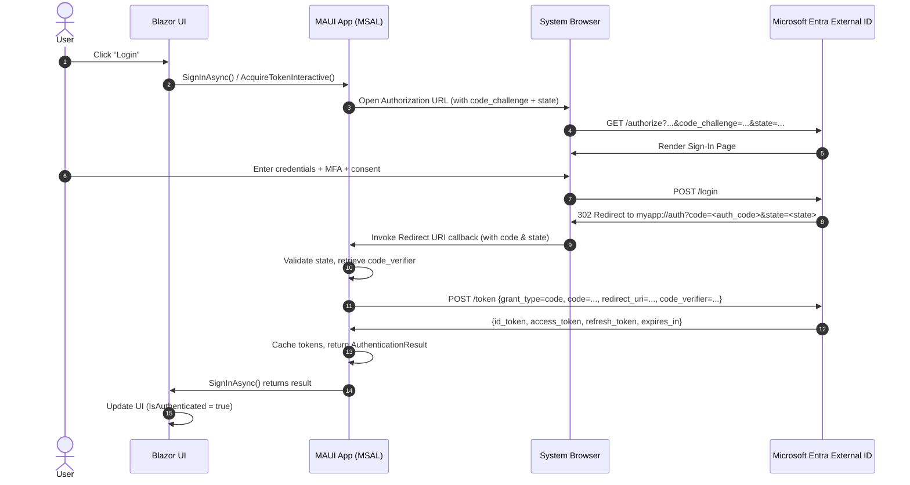


Below is a detailed activity diagram (using Mermaid) that illustrates the end‐to‐end OpenID Connect “authorization code” flow when you delegate authentication to the system browser in a . NET MAUI Blazor Hybrid Web App configured against Microsoft Entra External ID (Azure AD External ID). Following the diagram, you’ll find a step‐by‐step explanation of each interaction.

```mermaid
flowchart LR
  %%─────────────────────────────
  %% Swimlane: User
  %%─────────────────────────────
  subgraph User
    direction TB
    U1[1. Click Login in Blazor UI]
  end

  %%────────────────────────────────────────────────────
  %% Swimlane: MAUI App (Blazor + Native Bridge + MSAL)
  %%────────────────────────────────────────────────────
  subgraph MAUI_App[MAUI App]
    direction TB
    A1[2. JS Interop Start Auth]
    A2[3. MSAL AcquireTokenInteractive]
    A3[4. Launch System Browser]
    A4[8. Handle Redirect Callback]
    A5[9. MSAL Redeem Code for Tokens]
    A6[11. Acquire and Cache Tokens]
  end

  %%───────────────────────────────────────────────
  %% Swimlane: System Browser / WebView Host
  %%───────────────────────────────────────────────
  subgraph System_Browser[System Browser]
    direction TB
    B1[5. Browser navigates to /authorize URL]
    B2[6. User enters credentials and consents]
    B3[7. Redirect to app with auth code]
  end

  %%───────────────────────────────────────────────────────────────────
  %% Swimlane: Microsoft Entra External ID (Authority)
  %%───────────────────────────────────────────────────────────────────
  subgraph Microsoft_Entra[Microsoft Entra Authority]
    direction TB
    M1[6a. Validate Credentials and Consent]
    M2[6b. Issue Authorization Code]
    M3[10a. Validate Code and PKCE]
    M4[10b. Issue ID & Access Tokens]
  end

  %%──────────────────────────────────────────────────
  %% Links / Sequence of steps
  %%──────────────────────────────────────────────────
  U1 --> A1
  A1 --> A2
  A2 --> A3
  A3 --> B1
  B1 --> B2
  B2 --> M1
  M1 --> M2
  M2 --> B3
  B3 --> A4
  A4 --> A5
  A5 --> M3
  M3 --> M4
  M4 --> A6
```


---

## Step‐by‐Step Explanation

Below is a numbered walkthrough corresponding to each node in the diagram. You can follow the numbers \[1] through \[11] to see how control flows from the Blazor UI → MAUI app → system browser → Microsoft Entra → back to the MAUI app and finally to your Blazor UI.

---

### 1. User Clicks “Login” in Blazor UI

* **Component / Actor:** End-user interacting with your Blazor interface (rendered inside the MAUI WebView/Canvas).
* **Action:** The user clicks a “Sign In” or “Login” button (e.g. a Blazor `@onclick` handler).
* **Purpose:** Initiate the authentication flow. At this point, your Blazor page does not yet have any tokens; it needs to get an ID Token from Microsoft Entra External ID.

---

### 2. Blazor Invokes JS Interop → Start Auth

* **Component / Actor:** Blazor UI → C# backend in your .NET MAUI Hybrid.
* **Action:** Through JavaScript interop (e.g., `IJSRuntime.InvokeVoidAsync("interopStartLogin")` or a custom service), you call into your native MAUI code that wraps MSAL.

  * Typically, you have a Blazor “AuthenticationService” abstraction. When the user clicks “Login,” you do something like:

    ```csharp
    await _authenticationService.SignInAsync();
    ```
  * Internally, that `SignInAsync()` is implemented in MAUI’s shared code and calls MSAL’s `AcquireTokenInteractive()` method.
* **Purpose:** Transfer control from Blazor/Razor components into the native layer of the MAUI app, where MSAL can spawn the system browser.

---

### 3. MSAL AcquireTokenInteractive()

* **Component / Actor:** MAUI App → MSAL.NET library (Microsoft.Identity.Client).
* **Action:**

  1. **Build Authorization Request:** MSAL constructs the URL to the `/authorize` endpoint of your Microsoft Entra external ID tenant. This URL includes parameters such as:

     * `client_id=<your-client-id>`
     * `response_type=code`
     * `redirect_uri=<custom-scheme-URI or applink>`
     * `scope=openid%20profile%20<additional_scopes>`
     * `state=<cryptographically-random-value>`
     * **PKCE Challenge:** MSAL generates a random `code_verifier` and computes its SHA256 hash → `code_challenge`. It puts `code_challenge_method=S256` and `code_challenge=<base64-url-of-hash>` into the URL.
  2. **Populate “state”:** This is used to correlate the response and protect against CSRF. MSAL will store the original `state` value in memory so when the browser returns, it can validate.
  3. **Prepare to listen for Redirect URI:** MSAL tells your MAUI app to register a callback receiver. In MAUI, you typically register a custom URI scheme (e.g. `myapp://auth`) or an App Link (Android intent / iOS Universal Link). That way, when the system browser navigates to that scheme after successful login, your app’s event handler is triggered.
* **Purpose:** MSAL is assembling everything needed for the user to authenticate and handing off to the native OS to open a browser.

---

### 4. Launch System Browser with Authorization URL

* **Component / Actor:** MAUI App → OS.

* **Action:**

  * MSAL calls `Browser.OpenAsync(new BrowserOptions { ... })`, launching the system’s default browser (Safari, Chrome, Edge, etc.) with the generated URL.
  * The URL looks something like:

    ```
    https://<tenant-name>.b2clogin.com/<tenant-id>/oauth2/v2.0/authorize?
      client_id=<your-client-id>
      &response_type=code
      &redirect_uri=myapp%3A%2F%2Fauth
      &scope=openid%20profile%20api.read
      &code_challenge=<code_challenge>
      &code_challenge_method=S256
      &state=<state>
      &p=B2C_1A_signup_signin
    ```
  * The system browser window appears to the user, navigated to the Azure AD External ID policy (e.g. your sign-in policy or custom policy “B2C\_1A\_SignUpSignIn”).

* **Purpose:** To display Microsoft Entra’s (Azure AD External ID) hosted UI (login + any MFA / custom pages) in a secure, external browser context (not in an embedded WebView).

---

### 5. Browser Navigates to Authorization Endpoint

* **Component / Actor:** System Browser.
* **Action:**

  * The browser issues an HTTP GET for the `/authorize` endpoint shown above.
  * Because you’re using a custom policy (e.g., B2C\_1A\_SignUpSignIn), behind the scenes Azure AD External ID looks at your policy, determines which identity providers (e.g. local accounts, social logins) to show, etc.
* **Purpose:** Start the interactive sign-in experience.

---

### 6. User Enters Credentials & Consents

* **Component / Actor:** System Browser → Microsoft Entra External ID.
* **Action:**

  1. **Render Login Page:** Azure AD External ID renders the login page (username/pwd or social buttons).
  2. **User Interaction:** The user types in email/password (or uses social provider), completes MFA if configured, and consents to any requested scopes (e.g., T\&C, profile info).
  3. **Policy Execution:** The policy executes any custom claims rules, post-authentication migrations, or user-flow logic.
* **Purpose:** Authenticate the user’s identity and collect any required consent.

---

### 6a. (Inside the Authority) Validate Credentials, MFA, Consent

* **Component / Actor:** Microsoft Entra External ID (Azure AD).
* **Action:** The back end checks the credentials/MFA data against the user store or external IDP, enforces Azure AD External ID policies (password complexity, custom attributes), and if login is successful, moves on to issue an authorization code.

---

### 6b. (Inside the Authority) Issue Authorization Code

* **Component / Actor:** Microsoft Entra External ID.
* **Action:**

  * Azure AD External ID generates an Authorization Code (a short‐lived one‐time code).
  * It uses your `redirect_uri` (e.g. `myapp://auth`) and `state` to form a redirect response:

    ```
    HTTP/1.1 302 Found
    Location: myapp://auth?code=<auth_code>&state=<state>
    ```
  * The `code` is tied to the `client_id`, the `scope`, and includes the `code_challenge` you provided earlier.
* **Purpose:** Return the one‐time code to the app, so the app can later redeem it for tokens.

---

### 7. Redirect to Redirect URI with Authorization Code

* **Component / Actor:** System Browser → MAUI App (via OS).
* **Action:**

  1. The browser processes the 302 redirect and attempts to navigate to `myapp://auth?code=...&state=...`.
  2. The operating system sees that `myapp://auth` is a custom scheme (or App Link) that your MAUI app has registered to handle.
  3. The browser asks OS: “Which app handles `myapp://auth`?” and OS forwards that URL to your MAUI app’s `OnAppLinkRequestReceived` (or equivalent) handler.
  4. Your MAUI app’s MSAL “redirect URI callback” code is invoked with the full URL, including `?code=<auth_code>&state=<state>`.
* **Purpose:** Ferry the authorization code (and state) from the browser back into your MAUI app.

---

### 8. Handle Redirect URI Callback (Auth Code + State)

* **Component / Actor:** MAUI App → MSAL.
* **Action:**

  1. MSAL’s `WebAuthenticationCoreManager` (iOS) or `Broker` (Android) or `EmbeddedWebView` (if used) reads the full redirect URI.
  2. MSAL extracts the `code` and the `state` parameters from the URL.
  3. **Validate “state”:** MSAL checks that the returned `state` matches the one it originally generated in Step 3. If they mismatch, it aborts (CSRF protection).
  4. MSAL now has a valid `auth_code` and the original `PKCE code_verifier` in memory from Step 3.
* **Purpose:** Confirm authenticity of the response and prepare to exchange the code for tokens.

---

### 9. MSAL Redeems Code for Tokens (Code + PKCE Verifier → Token Endpoint)

* **Component / Actor:** MAUI App (MSAL) → Microsoft Entra External ID (Token Endpoint).
* **Action:**

  1. MSAL constructs an HTTP POST to:

     ```
     https://<tenant-name>.b2clogin.com/<tenant-id>/oauth2/v2.0/token
     ```

     with a form‐body containing:

     * `client_id=<your-client-id>`
     * `grant_type=authorization_code`
     * `code=<auth_code>`
     * `redirect_uri=myapp://auth`
     * `code_verifier=<original_code_verifier>`
     * **(If you configured a client secret, MSAL adds `client_secret=<your-client-secret>`. If you rely purely on public client + PKCE, then there is no client\_secret.)**
     * `scope=openid%20profile%20api.read` (scopes must match or be a subset of what was requested in Step 3)
  2. **PKCE Validation:** Azure AD External ID server recomputes `SHA256(code_verifier)` and compares it to the original `code_challenge` you sent in Step 3. If they match, the code is valid.
  3. **Validate Redirect URI:** Azure AD External ID checks that the `redirect_uri` matches the one registered for the client.
  4. **Validate Auth Code:** The server checks the code has not been used or expired, that it was issued for this `client_id` and under that policy.
* **Purpose:** Exchange the one‐time authorization code for a set of tokens.

---

### 10a. Authority Validates Code + PKCE Verifier

* **Component / Actor:** Microsoft Entra External ID.
* **Action:**

  * Ensures the posted `code_verifier` matches the `code_challenge` it saved when issuing the code.
  * Confirms the code is genuine, unexpired, tied to your `client_id` and `redirect_uri`.
* **Purpose:** Guarantee that only the legitimate client (which knows `code_verifier`) can redeem the code.

---

### 10b. Authority Issues ID Token + Access Token (± Refresh Token)

* **Component / Actor:** Microsoft Entra External ID.
* **Action:**

  1. **Generate Tokens:** Azure AD External ID returns a JSON payload:

     ```jsonc
     {
       "token_type": "Bearer",
       "scope": "openid profile api.read",
       "expires_in": 3600,
       "ext_expires_in": 3600,
       "access_token": "<opaque_JWT_access_token>",
       "id_token": "<JWT_id_token_with_user_claims>",
       "refresh_token": "<optional_refresh_token>"
     }
     ```
  2. **Sign + Encrypt:**

     * The ID Token is a JWT, signed by Microsoft Entra’s key, containing standard OpenID claims (`iss`, `aud`, `exp`, `iat`, `sub`, `name`, `oid`, etc.).
     * The Access Token might be a JWT or opaque string (depending on your policy).
     * If you requested offline\_access (or allowed issuance), a Refresh Token is also returned.
* **Purpose:** Provide your MAUI app a verifiable ID Token (identity), an Access Token (for APIs), and possibly a Refresh Token (to silently get new tokens later).

---

### 11. Acquire AccessToken / ID Token → Cache Tokens → Return to Blazor UI

* **Component / Actor:** MAUI App (MSAL) → Blazor UI.
* **Action:**

  1. **MSAL Stores Tokens:**

     * MSAL persists the tokens in its Token Cache (in secure storage on the device).
     * This enables silent sign-in (AcquireTokenSilent) later without re-prompting the user.
  2. **Return to Blazor:**

     * MSAL returns the `AuthenticationResult` (via the `AcquireTokenInteractive()` task) back to your C# `SignInAsync()` call.
     * Your code extracts `result.Account.Username`, `result.AccessToken`, `result.IdToken`, `result.ExpiresOn`, etc.
     * You update your Blazor UI state (e.g., set `IsAuthenticated = true`, `UserName = result.Account.Username`, etc.).
  3. **Blazor Re-routed / Re-Rendered:**

     * Now that the UI knows the user is authenticated, you can display protected pages or call your own APIs (passing the Access Token in the HTTP Authorization header).
* **Purpose:** Finalize the interactive sign-in flow and hand tokens back to the front‐end so that your Blazor components can show user data or call protected endpoints.

---

## Alternative Diagram: Sequence Diagram in Mermaid

If you prefer a **sequence diagram** (which can sometimes be clearer for chronological interactions), here is an equivalent depiction:



---

## Detailed Notes & Considerations

1. **PKCE (Proof Key for Code Exchange)**

   * PKCE is mandatory for public clients (mobile & SPAs).
   * MSAL automatically generates a `code_verifier`––a high‐entropy random string (e.g., 43–128 chars).
   * It then hashes (`SHA256`) that into a `code_challenge` and attaches `code_challenge_method=S256` to the authorization URL.
   * When exchanging the code for tokens, MSAL sends the original `code_verifier`. The server recomputes `SHA256(code_verifier)` and compares it to the original `code_challenge`. If it matches, the server knows this client legitimately obtained the code.
   * This prevents “code interception” attacks in pure‐JavaScript or public‐client scenarios.

2. **Redirect URI Configuration**

   * In Azure Portal (Entra > App registration > Authentication), you must add a platform for **Mobile and desktop applications** and set a Redirect URI using **Custom scheme** (e.g., `myapp://auth`).
   * On Android, you configure an intent‐filter that matches the scheme. On iOS, you register a URL type in Info.plist. MAUI templates handle much of this for you if you use the MSAL integration guide.
   * Make sure the `redirect_uri` in your MSAL options matches exactly what you registered (including letter‐case). Mismatches cause an “invalid redirect URI” error.

3. **MSAL Token Cache**

   * MSAL for .NET automatically persists tokens in a local token cache. In MAUI, you typically instruct MSAL to use a secure storage (e.g., Keychain on iOS, Keystore on Android).
   * When your Blazor UI later calls `AcquireTokenSilent(new[] { "api.read" }, account)`, MSAL checks the cache for a valid token. If expired, it uses the Refresh Token (if available) to get a fresh Access Token without prompting the user again.

4. **Blazor Hybrid Specifics**

   * In a Blazor Hybrid app, you have a mixture of WebView (for rendering Razor components) and native MAUI code (for platform‐specific features).
   * Typically, your “AuthenticationService” is implemented as a C# service registered in the Dependency Injection container.
   * When your Blazor component asks for sign-in, it calls into that C# service. The service uses MSAL.NET (configured in MauiProgram.cs) to handle all the interactive/workflow.

5. **Scopes & Consent**

   * In the authorization request (`/authorize`), you ask for `scope=openid profile offline_access <your_api_scope>`.
   * `openid` + `profile` are mandatory for OpenID Connect to return an ID Token.
   * `offline_access` requests a Refresh Token. If you don’t need offline, you can omit it, but that means no silent refresh.
   * `<your_api_scope>` is a scope exposed by your own App Registration or a Microsoft Graph scope. MSAL will present the consent UI if the user hasn’t previously consented.
   * If you only want ID Token (for UI auth) and not an Access Token, you can omit additional scopes, but usually you’ll want to call APIs.

6. **Custom Policies (Azure AD B2C / External ID)**

   * If you’re using Azure AD External ID (previously Azure AD B2C), you configure **User Flows** or **Custom Policies** (e.g., `B2C_1A_SignUpSignIn`).
   * The `p=` parameter in the `/authorize` URL indicates which user flow/policy to run (`p=B2C_1A_SignUpSignIn`).
   * Azure AD External ID then acts as an OIDC authority, issuing codes and tokens based on your policy’s orchestration steps (e.g., local account, social identity, MFA, custom claims).

7. **Error Handling & Edge Cases**

   * **Invalid State:** If the `state` returned doesn’t match what MSAL generated, MSAL will fail with a security exception.
   * **User Cancels Flow:** If the user closes the browser or taps “Cancel,” MSAL receives an exception (e.g. `MsalClientException` with error code `authentication_canceled`).
   * **Network Failures:** If there’s no connectivity when hitting `/authorize` or `/token`, MSAL throws a network-related exception. Your code should catch and show a user-friendly message.
   * **Policy Failures:** If a custom policy user flow encounters a problem (user account is flagged, or policy misconfigured), Azure AD External ID returns an error page. MSAL surfaces an `MsalServiceException` with details.

8. **Token Validation (Optional at Client Side)**

   * Although MSAL does basic validation of the ID Token (signature, `exp`, `nbf`, `aud`, etc.), if your Blazor UI ever needs to decode or inspect claims (e.g., to show the user’s name, roles, or custom attributes), you can parse the JWT.
   * In most Blazor Hybrid scenarios, you simply rely on MSAL’s `IAccount` object to read the username and basic claims; you don’t need to revalidate.

---

## Putting It All Together

1. **User Interaction (Steps 1–2):** The user clicks “Login,” Blazor calls into your MAUI‐layer service.
2. **MSAL‐Driven Auth Request (Steps 3–4):** MSAL builds an OIDC `/authorize` URL (with PKCE) and launches the system browser.
3. **Browser ↔ Authority (Steps 5–6b):** The system browser navigates to Azure AD External ID’s `/authorize` endpoint, user enters credentials, and the authority issues a one‐time code and sends it back via a custom scheme redirect.
4. **Back in the App (Steps 7–11):** The MAUI app intercepts the custom‐scheme redirect, MSAL redeems the code at `/token` (validating PKCE), obtains ID Token + Access Token (± Refresh Token), caches them, and passes control back to Blazor.
5. **Blazor UI Now Authenticated:** Your Razor components now know the user is signed in, can display user info, and can call secured APIs (by sending the Access Token in an `Authorization: Bearer <token>` header).

---

### How to Render This with Mermaid in Your Markdown

1. Copy the entire first code block (from \`\`\`mermaid down to the closing triple‐backticks).
2. Paste it into your Markdown file or README where your documentation is hosted (e.g., GitHub MD or any Markdown‐capable editor that supports Mermaid).
3. The diagram will render exactly as shown.
4. You can also copy/paste the sequence diagram (second code block) if you prefer that view for chronological interactions.

---

**Summary**:

* The activity diagram above shows each “actor” (User, MAUI App, System Browser, Microsoft Entra) in its own swimlane.
* You can trace how user input in Blazor leads to a system browser launch, how Azure AD External ID issues codes and tokens, and how MSAL in your MAUI app finishes the flow.
* Once the flow completes, you have an ID Token (for user identity) and an Access Token (for calling protected APIs), all obtained via a secure, PKCE‐protected authorization code flow in a public‐client mobile scenario.

Feel free to adapt the node labels (e.g., rename “Microsoft Entra” to “Azure AD External ID” or adjust custom policy names) to match your exact tenant configuration. If you need further details (e.g., how to configure the MAUI project’s `MauiProgram.cs` with MSAL or how to handle token caches), let me know!
